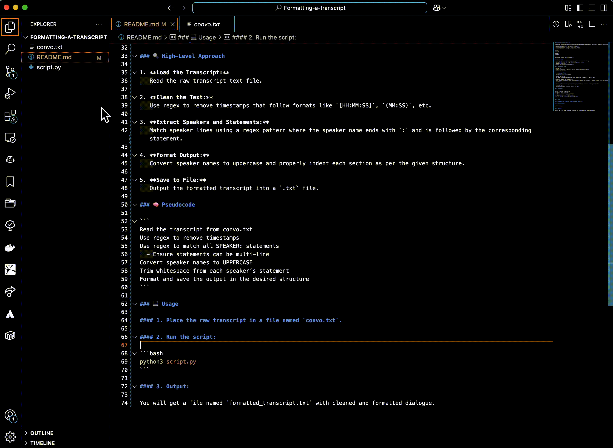

### Formatting-a-transcript by SJA

Given a raw, unformatted transcript containing timestamps and multiple speakers, your task is to write a script that:

* Removes timestamps (e.g., `[00:01:23]`, `(01:23)`)
* Detects and separates statements by different speakers
* Outputs the cleaned transcript in the following format:

```
SPEAKER1:
Statement.

SPEAKER2:
Statement2.
```

There can be up to 30 different speakers.

### ✅ Deliverables

* `script.py` – the main Python script that performs transcript formatting
* `convo.txt` – a sample raw transcript (input)
* `formatted_transcript.txt` – the cleaned and formatted output
* `README.md` – this file
* Approach and explanation included below



### 🛠 Technologies Used

* **Python 3**
* **Regular Expressions (regex)** for parsing speaker names and statements
* **Basic File Handling**

### 🔍 High-Level Approach

1. **Load the Transcript:**
   Read the raw transcript text file.

2. **Clean the Text:**
   Use regex to remove timestamps that follow formats like `[HH:MM:SS]`, `(MM:SS)`, etc.

3. **Extract Speakers and Statements:**
   Match speaker lines using a regex pattern where the speaker name ends with `:` and is followed by the corresponding statement.

4. **Format Output:**
   Convert speaker names to uppercase and properly indent each section as per the given structure.

5. **Save to File:**
   Output the formatted transcript into a `.txt` file.

### 🧠 Pseudocode

```
Read the transcript from convo.txt
Use regex to remove timestamps
Use regex to match all SPEAKER: statements
  - Ensure statements can be multi-line
Convert speaker names to UPPERCASE
Trim whitespace from each speaker’s statement
Format and save the output in the desired structure
```

### 💻 Usage

#### 1. Place the raw transcript in a file named `convo.txt`.

#### 2. Run the script:

```bash
python3 script.py
```

#### 3. Output:

You will get a file named `formatted_transcript.txt` with cleaned and formatted dialogue.
